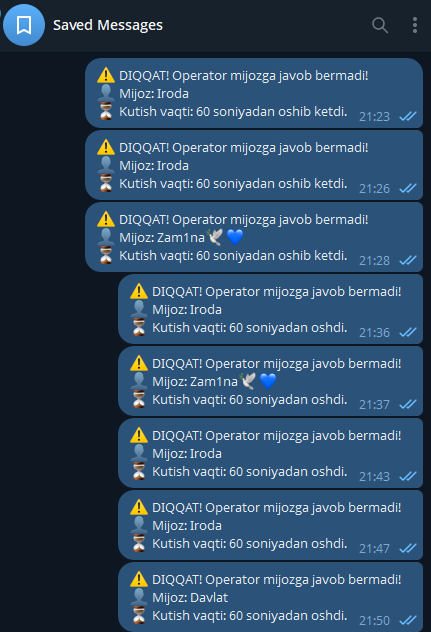
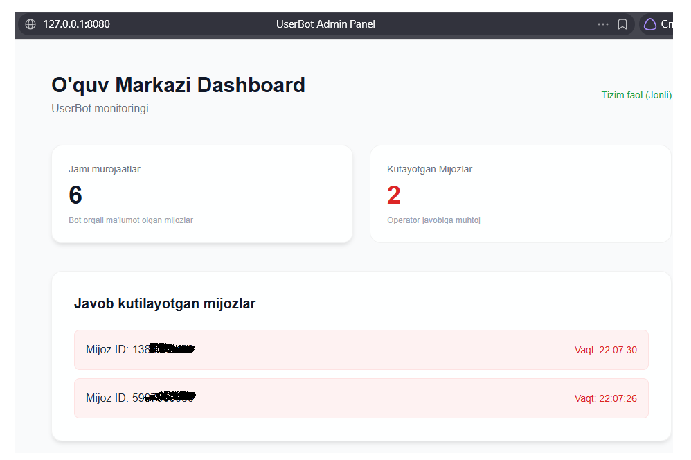

# O'quv markazlari uchun UserBot & Dashboard

Ushbu loyiha o'quv markazlari operatorlari faoliyatini nazorat qilish va mijozlarga xizmat ko'rsatishni avtomatlashtirish uchun ishlab chiqilgan zamonaviy tizimdir. 
Loyiha shaxsiy Telegram akkaunt orqali **UserBot** (Telethon) tarzida ishlaydi hamda mijozlarga javob berilishini jonli nazorat qiluvchi **Web Dashboard** (FastAPI) ni o'z ichiga oladi.

---

## 1. Asosiy imkoniyatlar
* **Avto-Javob:** Telegram orqali `/start` bosgan yoki umuman birinchi marta yozgan mijozlarga markaz haqida to'liq ma'lumotli tanishtiruv xabari yuboriladi.
* **Kutish xabari:** Mijoz javob kutayotgan vaqtda qayta yozsa, *"Kutib turing, operatorlarimiz band"* kabi xabar avtomatik yuboriladi.
* **Vaqtni nazorat qilish (Taymer):** Mijoz yozganidan so'ng belgilangan vaqt (masalan 60 soniya) ichida operator javob bermasa, Adminga *"Mijozga o'z vaqtida javob berilmadi!"* degan ogohlantirish keladi.


* **Veb Boshqaruv Paneli (Dashboard):** Adminlar maxsus web-sahifa orqali jonli efirda (Live) qancha mijoz murojaat qilganini va nechta mijoz ayni paytda javob kutayotganini ko'rib turadilar.

---

## 2. Loyiha Arxitekturasi
Hozirgi tizim 2 ta asosiy qatlamdan tashkil topgan:
1. **UserBot Core (Python / Telethon):** Telegram tarmog'iga ulanish va yozishmalarni ushlash / asinxron taymerlarni yuritish vazifasini bajaradi. O'z ma'lumotlarini JSON faylga (`clients_data.json`) yozadi.
2. **Veb-ilova (FastAPI + HTML/JS):** Ma'lumotlarni o'qib, brauzer orqali Dashboard ga jonli (har 2 soniyada) uzatib turuvchi API Veb-server.

---

## 3. Web Dashboard (Interfeys)
Quyida loyihaning Veb-interfeysi (Dashboard) qanday ishlashi ko'rsatilgan:



**Dashboard orqali siz qila olasiz:**
* **Jami murojaatlar sonini ko'rish:** Loyiha ishga tushganidan buyon bot orqali nechta odamga avto-javob borganligini aniqlash.
* **Kutayotgan Mijozlar (Pulse effekti):** Agar mijozga hali javob berilmagan bo'lsa, bu oyna qizil rangda yonib, mijoz ID raqami va uning qancha vaqtdan buyon kutayotgani ko'rsatiladi.

---

## 4. Loyihani ishga tushirish (O'rnatish)

### 1-qadam: Kutubxonalarni o'rnatish
```bash
pip install -r requirements.txt
```

### 2-qadam: Sozlamalar (.env)
Katalogni ichida `.env` nomli fayl yarating va Telegram API kalitlaringizni kiriting:
```env
API_ID=sizning_api_id_raqamingiz
API_HASH=sizning_api_hash_kodingiz
```
*(Qo'shimcha tarzda `config.py` faylidan mijozlarga boradigan matnlarni o'zgartirishingiz mumkin).*

### 3-qadam: Tizimni ishga tushirish
*(Birinchi marta botni o'zingizning Telegram akkauntingizga ulash uchun QR-kod orqali bitta login qilib olasiz. Buning uchun terminalda quyidagicha yozing):*
```bash
python -m bot.qr_login
```

Tizim to'liq ishlashi uchun 2 ta terminal (konsol) kerak bo'ladi:

**Botni ishga tushirish (1-terminal):**
```bash
python -m bot.main_bot
```

**Veb panelni ishga tushirish (2-terminal):**
```bash
python -m api.api
```
Shundan so'ng brauzer orqali **`http://127.0.0.1:8080`** manziliga kirsangiz, boshqaruv paneli ishga tushadi!
